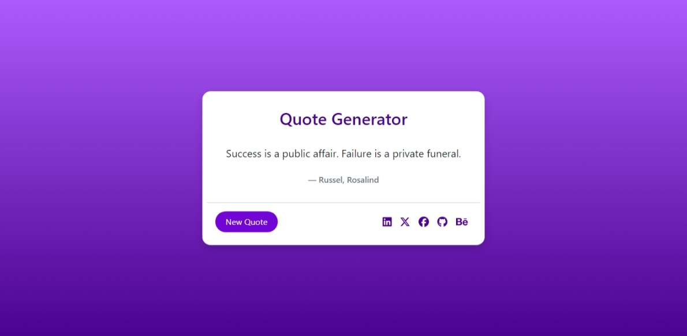
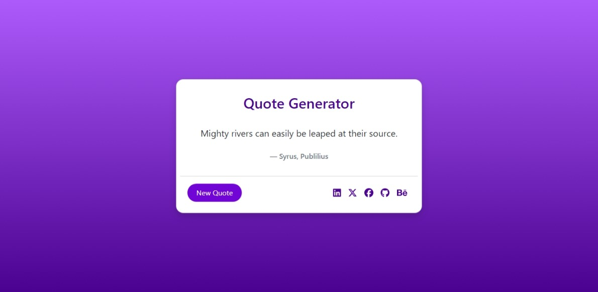

# Quote Generator in React JS

## Overview

This project is part of the Codevixens Frontend Development Challenge (Day 4). It is a simple quote generator built using React. It demonstrates how to fetch data from an external API ([API Ninjas](https://api-ninjas.com/api/quotes)), manage state, and create a basic user interface.

## Features

- **API Integration:** Fetches random quotes from the [API Ninjas Quote Generator API](https://api.api-ninjas.com/v1/quotes).
- **State Management:** Uses React's `useState` and `useEffect` hooks to manage the fetched quote and author data.
- **Loading Indicator:** Displays a loading spinner while fetching a new quote.
- **Simple UI:** Includes a button to fetch a new quote and a display area for the quote and author.

## Installation

1. Clone the repository:

```bash
git clone https://github.com/gideonagyage/Quote-Generator.git
```

2. Navigate to the project directory:

```bash
cd Quote-Generator
```

3. Install dependencies:

```bash
npm install
```

## Usage

1. Start the development server:

```bash
npm start
```

2. Open your browser and navigate to

```bash
http://localhost:3000.
```

## How it Works

The `QuoteGenerator` component is responsible for fetching quotes, managing state, and rendering the UI.

1. **Fetching Quotes**: The `fetchQuote` function uses `axios` to make a GET request to the API.
2. **State Management**: The `quote`, `author`, and `isLoading` state variables are updated with the fetched data and loading status.
3. **UI Rendering**: The component renders a button that triggers the `fetchQuote` function and a display area that shows the current quote and author.

## Screenshots

- First Quote

<br>



<br> <br>

- Second Quote

<br>



## Live Demo

Check out the live demo [here](https://quote-generator-three-peach.vercel.app/).

## Key Concepts

1. **API Calls**: Making requests to external services to retrieve data.
2. **State Management**: Using React hooks to manage data that changes over time.
3. **Hooks**: Functions that let you "hook into" React features like state and lifecycle methods.

## Contributing

Feel free to fork this repository and submit pull requests. Any contributions are welcome!

## License

This project is licensed under the MIT License.

## Acknowledgements

- Codevixens for organizing the challenge.
- Chinaza Igboanugo, Lois Bassey, and Oyinkansola Shoroye for their contributions and guidance.

Feel free to customize it further to fit your needs! If you have any specific details you'd like to add or change, let me know.
